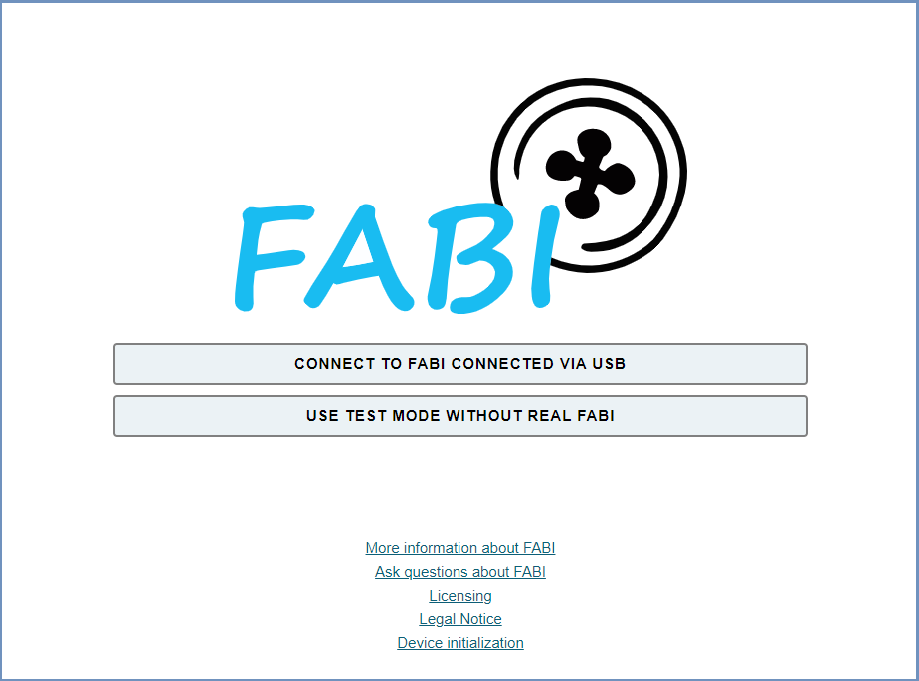
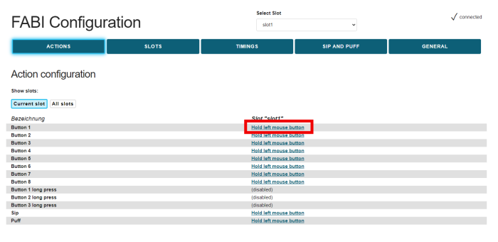

# FABI - User Manual

____

# Welcome to FABI

FABI - the "Flexible Assistive Button Interface" - allows you to connect up to eight buttons to a computer or tablet/smartphone to trigger mouse or keyboard actions and perform other actions. A configured FABI module can be used with any computer (Windows, Linux or Mac), without installing special software, because when connected to the computer, the FABI module behaves like an ordinary computer mouse or keyboard. People for whom conventional input devices are not suitable can thus play computer games, surf the Internet, write e-mails and much more.

The FABI system can be used with commercially available switches, inexpensive arcade buttons, or even homemade electrical contacts. FABI consists of a hardware module (an inexpensive microcontroller that acts as a computer mouse or keyboard), other optional modules and sensors (Bluetooth add-on, sip/puff pressure sensor), and a graphical configuration interface for setting desired functions ("FABI configuration manager").

FABI is available as an open source kit (including corresponding assembly instructions for the hardware) and was developed as part of the AsTeRICS Academy project at the FH Technikum Wien. In 2017, the non-profit organization AsTeRICS Foundation was founded to further develop such technologies and systems and to make them available at low cost: [www.asterics-foundation.org](https://www.asterics-foundation.org/1270-2/).

All software modules, hardware design files, and how-to documents are available under free open source licenses and can be used and modified for free. We have made every effort to select the lowest cost components, yet not compromise on functionality and flexibility - making FABI an affordable pushbutton interface with extensive capabilities!

#### About this manual

This manual is used to explain the configuration interface and the possible settings and functions of the FABI system. The building instruction can be found in a separate document.

## Introduction

The FABI configuration manager is required to be able to define the functions of the buttons. Once a configuration has been saved in the FABI system, it remains there and the FABI system can be used to control different devices (e.g. Windows PC, Mac computer, tablet or smart phone with USB or Bluetooth connection). The configuration manager is only needed again if settings are changed.

The configuration manager has to be opened in the Chrome web browser and can be found at the following address: [fabi.asterics.eu](https://fabi.asterics.eu/index_fabi.htm). Below in figure 1 you can see the welcome page. If you click on CONNECT TO FABI CONNECTED VIA USB, no communication port (COM port) will be selectable in the selection box yet, unless you have connected the FABI module to the computer using the USB plug.

*Figure 1*: Welcome page of the configuration manager

#### Connecting the USB micro cable

*Figure 2*: Connecting the USB micro cable

#### Connecting the FABI device

To use the web configuration functions, follow the steps below. 1:

1. Make sure that the FABI device is connected to the computer.
2. After that, a communication port (COM port) with a certain number (e.g. COM4) should be selectable in a pop-up window. Click on this COM port and then click on *Connect*. (After unplugging the FABI module the COM port should disappear again).
3. **If you cannot see the user interface of the FABI configuration manager as in Figure 3, open the website again and select another COM port in the selection box that pops up. Then click again on *Connect*.**

## Using the configuration manager

After connecting to the communication port of the FABI system, you will now see the user interface of the FABI Configuration Manager (Figure 3).
 

*Figure 3*: FABI Configuration Manager User Interface

#### Port Status

The port status at the top right shows whether the FABI device is currently connected to the configuration manager. The set functions of the buttons can only be transferred to the device if "Connected" is displayed as the port status. If the device is no longer connected, you will return to the start page.

#### Save settings

The settings made are automatically saved and are immediately active in the FABI device. **The configurations are retained even if the FABI system is disconnected from the USB cable or power supply.**

### Assigning the button functions (tab "ACTIONS")

In the **ACTIONS** tab, up to 8 buttons can be assigned different functions. The functions include, for example, various mouse clicks, mouse movements, operation of the mouse scroll wheel or keyboard keys. You can change the action for the respective button by clicking on the underlined (currently active) action to the right of the desired button - see red square in Figure 6. Then a window appears where the desired action category (here: mouse) and the desired action can be selected (here: hold left mouse button). *Note:* If more than 8 buttons are needed, several FABI modules can be operated in parallel.

 

*Figure 4.1*: Select/change action for button

 

*Figure 4.2*: Select action for button (here: Button 1)

#### Action category: Mouse

##### Hold Left/Right/Middle Mouse Button (as long as input action)

By these functions the left, right or middle mouse button remains pressed as long as the button is held (for example, to move a file it is necessary to keep the left mouse button pressed).

##### Click left/right/middle mouse button

With these functions a click of the left, right or middle mouse button can be executed by pressing the button. **Note**: a click consists of pressing & releasing the corresponding mouse button, both happen shortly after each other after pressing the button!

##### Double-click left mouse button

Double-clicking the left mouse button is necessary to open a file, for example. However, performing quick mouse clicks can be difficult for some users. By assigning this function, a double click can be performed by simply pressing the button.

##### Press or release left/right/middle mouse button (toggle).

These functions change the state of the left, right or middle mouse button when the button is pressed. Note that the mouse button remains pressed until the button is pressed again!

##### Scroll down / scroll up

The functions "Scroll up" and "Scroll down" create activities with the one scroll wheel of the computer mouse by the button. Triggering the "Scroll up" function will cause scrolling upwards, triggering the "Scroll down" function will cause scrolling downwards (useful for reading documents or web pages for example).

##### Move mouse horizontally / vertically - mouse movement in x or y direction.

The "Move mouse horizontally (x-axis)" and "Move mouse vertically (y-axis)" functions generate computer mouse movements along the selected axes. Speed parameters can be set for these functions in the field that appears below. When the button is pressed, the mouse pointer is accelerated up to this maximum speed (e.g. 20 or -20).

*A positive value for the X direction moves the mouse pointer to the right.
A negative value for the X-direction moves the mouse pointer to the left.
A positive value for the Y direction moves the mouse pointer down.
A negative value for the Y direction moves the mouse pointer upward.*

 

*Figure 5*: Screenshot of the "Move mouse horizontally (x-axis)" function or speed setting.

#### Action category: Keyboard

##### Hold key(s) (as long as input action)

With the function "Hold key(s) (as long as input action)" desired keys of the computer keyboard can be held as soon as the key is pressed. The previously selected keyboard key(s) will be held down for as long as the key is held down. The key selection works as described for the "Press or relase key(s) (toggle)" command.

##### Press key(s) + release automatically

The "Press key(s) + release again"-function allows to trigger desired keys (also combinations) of the computer keyboard as soon as the button is pressed. The keyboard keys are pressed and released immediately (i.e. not held down as long as the button is held down).

##### Press or release key(s) (toggle)

The "Press or Release Key(s) (toggle)" function allows desired keys on the computer keyboard to change their state (i.e. be pressed or released) as soon as the key is pressed. Note that the keyboard key remains pressed until the key is pressed again! The key selection works as follows:

 

*Figure 6*: Screenshot of the "Press or release key(s) toggle" function

The desired key can be selected in each case from the selection box, which can be opened to the left of "Add" with the arrow. Then click on "Add" and the input also appears in the next line ("Insert Keys"). The example in Figure 8 shows the use of the keyboard key "KEY_D" - this will cause a lowercase "d" to be written each time the key is pressed. It is also possible to select several keys for key combinations, which are then pressed/held simultaneously. Alternatively to the individual selection of keys from the selection box, keys or key combinations can also be recognized automatically if the "Input keys with keyboard" field is activated. 
Keys that have already been assigned can be removed by clicking "CLEAR".

**Note:** With "KEY_SHIFT" capital letters can be used. All other supported keyboard shortcuts can be found in the appendix.

##### Write word

The "Write word" function allows to write a certain text every time the selected button is pressed. This can be useful for entering passwords, for example. When you select "Write word", an empty text field appears under the drop-down menu, then click on the text field and enter the desired text:
 

*Figure 7*: Screenshot of the "Write word" function

#### Action category: Device

##### No command (empty)

If "No command" is selected in the function menu, the corresponding button will be disabled.

##### Load next slot - switch to next configuration

As soon as the button is pressed, the next memory location (slot) is activated. This allows the individual slots to be switched through in sequence using a pushbutton. After the last configuration, the first configuration is automatically activated. (This action is only relevant if you have stored configurations in several memory slots).

##### Load slot by name - switch to configuration with specific name

As soon as the button is pressed, the configuration with the specified name is activated. (This action is only relevant if you have stored configurations in several memory slots).

#### Action category: Macro

##### Custom Macro - Execute Macro Commands

This advanced feature allows multiple commands to be executed using appropriate command shortcuts, providing a high degree of flexibility. The individual commands are entered in the text field separated by semicolons. Command shortcuts can also be selected using "Add Command" and then added to the macro using "ADD". If several commands are added in succession, the semicolons are entered automatically.
Example: The macro command MX 10; WA 500; KP KEY_A; moves the mouse cursor 10 points to the right, then waits 500 milliseconds and presses the keyboard key "A".
**Note**: The possible commands that can be added are listed as soon as the arrow on the right is pressed. However, the possible command and keyboard shortcuts can also be entered manually in the "Macro" line, and can also be found at the end of this documentation.

### Using the memory locations (tab "SLOTS")

Various function assignments of the buttons can be stored in up to 10 memory locations (***configuration slots***). These memory slots can also be changed during operation, e.g. via any button. As soon as the FABI device is supplied with power via the USB cable, the first memory location (slot) is automatically loaded and activated.

*Figure 8*: Creating, changing and deleting memory locations ("Slots").

A new memory slot is created in the **SLOTS** tab by clicking **CREATE SLOT**. The settings of the currently active slot are taken over (copied). With a preceding click in the text field, any name can be assigned to the new slot. In the top center there is a dropdown menu with the heading **"Select slot "**. If you click on the arrow on the right side of the text field, the dropdown menu opens showing slots that have already been saved and they can be selected here. In the **Slot configuration** list you can see all the available slots, with the active slot displayed in bold letters. Here you can also select the color, that is displayed when a slot is activated on the FABI device. The slots can be deleted individually or downloaded to the computer if required.

#### Selecting a color for the configuration

By clicking on the "Set color" field to the right of the corresponding slot in the **SLOTS** tab, a color selection dialog appears on the screen. A desired color can be selected here. The color light-emitting diode in the FABI housing assumes this color as soon as the corresponding configuration is activated. In this way, characteristic colors can be assigned to all configuration slots. **Note**: This function is only available in the new version (PCB version) of the FABI system.

#### Loading, saving and transferring configurations

If you scroll further down in the **SLOTS** tab, you will find functions for the slot backup. Here you can upload slots from a file: After clicking "Select File", a local file on the computer that contains configuration settingscan be selected. These settings are transferred to the FABI device in their entirety by clicking "Upload and replace all slots"; the current configuration is deleted in the process. However, individual slots from the configuration file can also be added to the active FABI configuration. To do this, select the desired slots after the advanced options have been displayed and transfer them to the device by clicking "Upload selected slot(s)".

Saving the current configuration settings of the FABI system to a file is enabled by clicking "Download all slots" (see Figure 5). Here, the entire configuration is saved as a file (.set) on the computer. This settings file can then be transferred to the same or another FABI device. This allows multiple setups (for example for different users or use cases) to be saved on one computer and activated with one click.

**Attention**: When downloading individual slots or the entire setups, the files are stored in the download directory of the web browser. It makes sense to put the files in another directory afterwards so that they can be easily found and are not accidentally deleted in the download directory.

#### Predefined settings

In the **SLOTS** tab, prepared configuration settings can be selected at the very bottom in the "Predefined settings" area (see Figure 5). These offer an overview of the possibilities of the FABI system and serve as a suggestion for your own applications, such as a 1-button mouse control, a 2-button control of computer and smart phone or a use of mouse and cursor keys with multiple buttons. A description for the demo configurations can be displayed and provides brief information about the functions or button assignments.

*Figure 9*: Loading and saving configuration settings

### Setting options in tab "TIMINGS"

The **TIMINGS** tab can be used to set further parameters for the operation of the FABI system. In the antitremor settings, threshold values for pressing and releasing can be determined. These antitremor settings are used to prevent accidental pressing or releasing due to hand tremor. Furthermore, thresholds can be set for long presses, double presses to advance slots, and automatic left clicks. All these settings are explained in more detail below.
**Note**: these settings only apply to the active slot (memory location).

 

*Figure 10*: Screenshot of further settings in the "Timings" tab

#### Antitremor settings

The Anti-Tremor parameters can be used to define different time periods that are checked by the FABI system when a button is triggered. This can be used to minimize involuntary triggering of buttons in the presence of tremor or fine motor control problems:

- "Antitremor time for press" sets the minimum amount of time a button must be pressed for the action to occur.
- "Antitremor time for release" sets the minimum amount of time a button must be released for the release to be detected.
- "Antitremor idle time" sets the minimum amount of time that must elapse between successive presses of a button.

#### Thresholds for special functions

##### Threshold for long press

The "**Threshold for long press**" specifies a time period in milliseconds above which pressing a button is interpreted as a "Long press" and consequently an alternative action can be performed. This is particularly useful if a person can only use a small number of buttons. A long button press can then be used to perform an alternative function (e.g. switching the configuration). The corresponding functions can be defined in the "ACTIONS" tab under "Button x long press".
The long press function is disabled if a time span of 0 milliseconds is set.
Currently, only buttons that are plugged into ports 1, 2 or 3 support the long press function.

##### Using the "Double Press" Function

The value "**Threshold for slot change by double press**" defines the maximum duration of a "double press" in milliseconds. If a fast double press of a key is detected, an **automatic slot change to the next slot** is performed. This is especially useful if a person can only use a single key: Two quick key presses can change the function of the key. For example, several keyboard keys could be pressed alternately (e.g. for game control) or the mouse pointer can be moved in different directions with a single switch.

##### Threshold automatic left click

This setting makes it possible to generate a left mouse click after the mouse has been moved. If the selected time period (in milliseconds) elapses without further mouse movements, then the mouse click is generated automatically. This allows complete control of a mouse pointer with a small number of buttons or (in combination with the automatic slot change function) with only one button. A value of 0 milliseconds switches off the automatic click function.

### Use of a pressure sensor (Sip-/Puff) - (tab "SIP AND PUFF").

If an analog pressure sensor like e.g. the sensor type MPXV7007GP is connected to the FABI system, actions for Sip and Puff (suck and blow) can be defined. The analog voltage value is connected to the solder contact A0 on the microcontroller board. Furthermore the sensor must be supplied with voltage (connect 5V and GND correctly).

Thereupon, in the tab "**SIPP-PUFF CONTROL**", corresponding threshold values for the strength of the sipping or puffing can be set. Further functions can be triggered by these activities. The idle value of the sensor (when neither suction nor blowing is performed) is in the middle of the value range, at approx. 512.

In the "**ACTIONS**" tab, as with the buttons, a corresponding action can be selected that is to be carried out during sipping or puffing.

*Figure 11*: Screenshot of the settings for sipping and puffing thresholds

### Setting options in tab "GENERAL"

In the **GENERAL** tab, the Bluetooth settings can be adjusted and the firmware and Bluetooth firmware can be overwritten / updated.

 

*Figure 12*: Screenshot of further settings in the "GENERAL" tab

#### USB Mode / Bluetooth Mode

The optional Bluetooth module (add-on) allows keyboard and mouse actions to be sent to a connected ("paired") Bluetooth-enabled device (such as a smartphone or tablet computer). If a Bluetooth module is installed in the FABI housing, it can be defined in the selection box for each slot whether the mouse and keyboard actions are to be generated via USB or via Bluetooth (or both) (Figure 13):

 

*Figure 13*: Bluetooth mode or rather USB/Bluetooth selection

**Note**: The USB/Bluetooh mode selection is only useful if the optional Bluetooth add-on module is connected to the FABI device (see "Using the Bluetooth module"). 
Since this setting is defined per memory location (slot), it can be different for different memory locations. For example, the same FABI device can be used to control a laptop via USB and a smartphone/tablet via Bluetooth. Switching is done simply by changing the active slot.

#### Overwrite / update firmware

Pressing this button will attempt to download and install the latest software (firmware) for FABI main module (the microcontroller). This process may take a few minutes. To the left of the button, the version number of the currently installed firmware and the version available for update are displayed.

#### Overwrite / update Bluetooth firmware

Pressing this button will attempt to download the latest software (firmware) for the Bluetooth module and install it on the module. This process can take a few minutes and is only possible if a Bluetooth module is connected to the FABI system. To the left of the button, the version number of the currently installed firmware and the version available for update are displayed. Here it can also be determined whether a Bluetooth module is installed or whether the module is recognized.

#### Reset to default configuration, key combinations

At the bottom of the tab you will find the button for resetting the FABI device to the default settings or configuration. This is useful if the current settings cause problems with the use of the device. Furthermore you can see the key combinations for quick switching between the tabs.

 

*Figure 14*: Reset device, key combinations

**Have fun trying out and creating your own FABI configurations!**

### Using the Bluetooth module

The FABI system allows the use of an optional Bluetooth "AddOn" module for wireless device connections to cell phones, tablets and computers with Bluetooth capability. The Bluetooth module is available separately from the AsTeRICS Foundation or included in the corresponding version of the FABI kit.

#### Installation of the Bluetooth module

The Bluetooth module is very easy to use with the board version of the FABI system (kit). (Use with a single microcontroller is also possible and is described in more detail in the further information in the [Github Repository](https://github.com/asterics/esp32_mouse_keyboard) of the Bluetooth module.
The Bluetooth module is plugged onto the 10-pin connector in the orientation shown on the board. To do this, open the FABI housing and push the module onto the pin header provided as far as it is possible (see Figure 15): 

*Figure 15*: Bluetooth module, plugged onto the FABI board

#### Connecting to a Bluetooth device (pairing)

The Bluetooth module indicates that it is ready to connect to a target device by flashing rapidly (approximately 2 times per second). (The flashing of the module can be perceived on the bottom of the FABI housing). The target device for the connection (for pairing) can be, for example, a cell phone or tablet. A new device must be added in the Bluetooth settings of the target device. Here it should be possible to select the "FABI" device. If the connection is successful, the LED of the Bluetooth module should flash slowly (approx. 1 time per second). The target device can now be controlled via the FABI system in parallel to the device connected via USB. The decision whether an action is performed via USB or via Bluetooth is made in the settings in the **GENERAL** tab (see Figure 13).

## Supported Macro commands:

| **Abbreviation** | **Function**                                                                                                                   | **example**                                                                                 |
| ---------------- | ------------------------------------------------------------------------------------------------------------------------------ | ------------------------------------------------------------------------------------------- |
| CL               | click left mouse button                                                                                                        |                                                                                             |
| CR               | click right mouse button                                                                                                       |                                                                                             |
| CM               | click middle mouse button                                                                                                      |                                                                                             |
| CD               | click double with left mouse button                                                                                            |                                                                                             |
| HL               | hold the left mouse button                                                                                                     |                                                                                             |
| HR               | hold the right mouse button                                                                                                    |                                                                                             |
| HM               | hold the middle mouse button                                                                                                   |                                                                                             |
| TL               | toggle left mouse button                                                                                                       | changes the state of the mouse button                                                       |
| TM               | toggle middle mouse button                                                                                                     |                                                                                             |
| TR               | toggle right mouse button                                                                                                      |                                                                                             |
| RL               | release the left mouse button                                                                                                  |                                                                                             |
| RR               | release the right mouse button                                                                                                 |                                                                                             |
| RM               | release the middle mouse button                                                                                                |                                                                                             |
| WU               | move mouse wheel up                                                                                                            |                                                                                             |
| WD               | move mouse wheel down                                                                                                          |                                                                                             |
| MX <int>         | move mouse in x direction                                                                                                      | MX 4 -> moves cursor 4 pixels to the right                                                  |
| MY <int>         | move mouse in y direction                                                                                                      | MY -10 -> moves cursor 10 pixels up                                                         |
| RO <int>         | rotate stick orientation                                                                                                       | RO 180 -> flips x and y movements of stick/mouthpiece                                       |
| KW <string>      | keyboard write string                                                                                                          | KW Hello! -> writes "Hello!" on the keyboard                                                |
| KP <string>      | key press: Press keyboard keys (once). Keys are identified by keyboard shortcuts (see list below)                              | KP KEY_UP -> presses the "Cursor-Up" key; KP KEY_CTRL KEY_ALT KEY_DELETE presses all 3 keys |
| KH <string>      | key hold: hold keyboard keys                                                                                                   | sKH KEY_LEFT -> holds the "Cursor-Left" key                                                 |
| KT <string>      | key toggle: toggle keyboard keys; the key will remain pressed until "AT KT" command is sent again or a "AT KR" command is sent | KT KEY_DOWN -> toggles the "Cursor-Down" key                                                |
| KR <string>      | key release                                                                                                                    | KR KEY_UP -> releases the "Cursor-Up" key                                                   |
| RA               | releases all = Release all currently pressed keys and mouse buttons                                                            |                                                                                             |
| WA <int>         | wait a certain number of milliseconds                                                                                          | WA 100 -> waits 100 milliseconds                                                            |
| NE               | next slot: load next slot                                                                                                      |                                                                                             |
| LO <string>      | Load slot per name, changes to the given slot                                                                                  | LO mouse                                                                                    |
| NC               | No command                                                                                                                     |                                                                                             |

### Supported Key Identifiers:

| **Supported KEY Identifiers:**                                                                                                                                                                                         |
| ---------------------------------------------------------------------------------------------------------------------------------------------------------------------------------------------------------------------- |
| **Letters**                                                                                                                                                                                                            |
| KEY_A  KEY_B  KEY_C  KEY_D  KEY_E  KEY_F  KEY_G  KEY_H   KEY_I  KEY_J  KEY_K  KEY_L  KEY_M  KEY_N  KEY_O  KEY_P   KEY_Q  KEY_R  KEY_S  KEY_T  KEY_U  KEY_V  KEY_W  KEY_X KEY_Y KEY_Z                           |
| **Digits**                                                                                                                                                                                                             |
| KEY_1  KEY_2  KEY_3  KEY_4  KEY_5  KEY_6  KEY_7  KEY_8  KEY_9  KEY_0                                                                                                                                                   |
| **Function keys**                                                                                                                                                                                                      |
| KEY_F1  KEY_F2  KEY_F3  KEY_F4  KEY_F5  KEY_F6  KEY_F7  KEY_F8  KEY_F9  KEY_F10   KEY_F11  KEY_F12  KEY_F13  KEY_F14  KEY_F15  KEY_F16  KEY_F17  KEY_F18  KEY_F19  KEY_F20  KEY_F21  KEY_F22  KEY_F23  KEY_F24 |
| **Navigation keys**                                                                                                                                                                                                    |
| KEY_UP  KEY_DOWN  KEY_LEFT  KEY_RIGHT  KEY_TAB  KEY_PAGE_UP  KEY_PAGE_DOWN  KEY_HOME  KEY_END                                                                                                                      |
| **Special keys**                                                                                                                                                                                                       |
| KEY_ENTER  KEY_SPACE  KEY_BACKSPACE  KEY_DELETE  KEY_INSERT  KEY_ESC  KEY_NUM_LOCK KEY_SCROLL_LOCK  KEY_CAPS_LOCK  KEY_PAUSE                                                                                   |
| **Tasten für alternative Funktionen**                                                                                                                                                                                  |
| KEY_SHIFT  KEY_CTRL  KEY_ALT  KEY_RIGHT_ALT  KEY_GUI  KEY_RIGHT_GUI                                                                                                                                                    |

### Further links and software recommendations

The FABI Button Interface is suitable as an alternative input system for a wide range of applications - from computer/smartphone control to the use of games and educational software. Depending on the number of buttons that can be used, standard programs with mouse / keyboard can also be used here without further adaptation.

If motor skills or the number of usable button functions are very limited, specially adapted applications also offer possibilities for use with only one button. Some interesting resources are presented below:

#### AsTeRICS and AsTeRICS Grid

The further open source developments of the [AsTeRICS Foundation](https://www.asterics-foundation.org) allow a versatile use of button interfaces. The [AsTeRICS](https://www.asterics.eu) system is a construction kit for assistive technologies with which 1-button procedures for computer control can be created. [AsTeRICS Grid](https://grid.asterics.eu) is a flexible system for AAC (UK, AAC) that can also be used with single push buttons.

#### SpecialEffect.org

The non-profit organization SpecialEffect ([www.specialeffect.org.uk](https://www.specialeffect.org.uk)) is dedicated to spreading accessible gaming in the UK and makes special adaptations for people with disabilities.

#### BLTT.org

The Better Living Through Technology website ([bltt.org/introduction-to-switch-access](https://bltt.org/introduction-to-switch-access)) provides useful information for button-based use of computers and links to many software tools.

#### OneSwitch.org

At [www.oneswitch.org.uk](https://www.oneswitch.org.uk/) Barrie Ellis has collected a wealth of tips and information for single-switch gaming and special adaptations for button controls of computer games. Of particular interest are the game library, the one-switch pulse system, and the use of game consoles via controller adapters like the "Titan-Two".

#### Click2Speak

[Click2Speak](https://www.click2speak.net) is a flexible on-screen keyboard for Windows that provides additional useful features - such as a mouse click selection box.

## Contact Information

**AsTeRICS Foundation**

Webpage: <https://www.asterics-foundation.org>
Email: <office@asterics-foundation.org>

## Disclaimer

The University of Applied Sciences Technikum Wien and the AsTeRICS Foundation do not assume any warranty or liability for the functionality of the hardware/software modules or the correctness of the documentation.

Furthermore, the FH Technikum Wien and the AsTeRICS Foundation are not liable for any damage to health caused by the use of the provided hardware/software modules. 
The use of the provided modules and information is at your own risk!

## Acknowledgements

We would like to thank Miriam Brenner, Fabian Schiegl and Fanny Peternell for their support in writing this manual and Andreas Fußthaler for developing the FABI-PCB version.

This project was financially supported by the City of Vienna (Magistratsabteilung 23 für Wirtschaft, Arbeit und Statistik, MA 23) (project number 14-02, 18-04).

