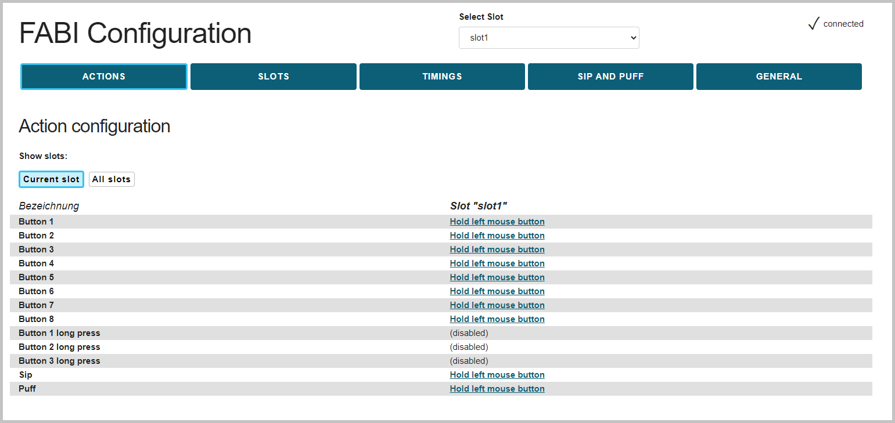
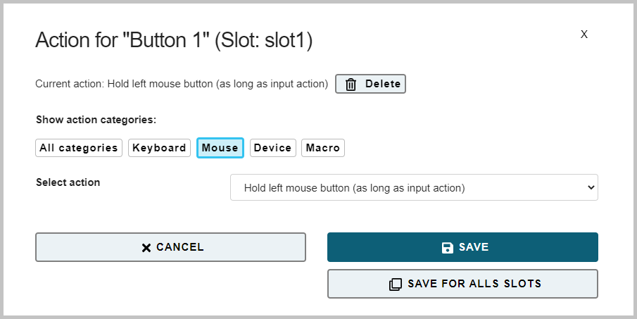
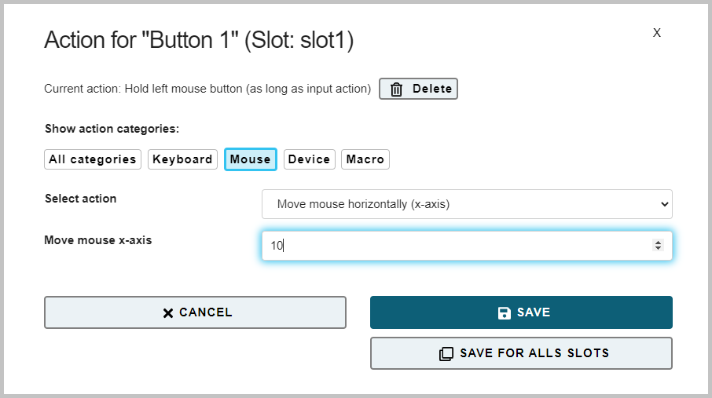
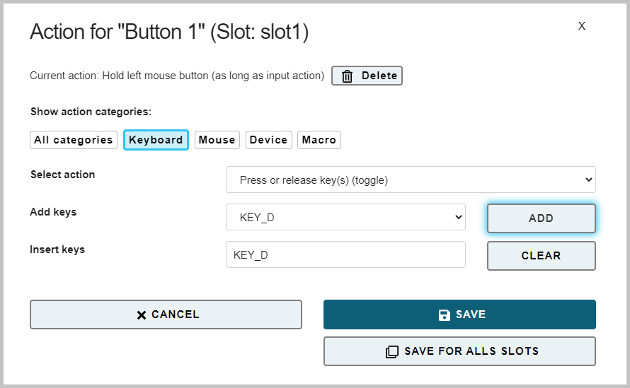
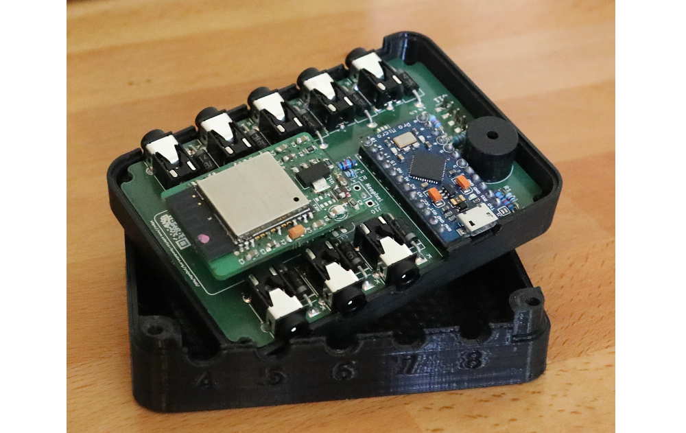

# FABI - User Manual

____

# Welcome to FABI

FABI - the "Flexible Assistive Button Interface" - connects up to eight momentary switches (buttons) to a Personal Computer, smartphone or tablet, in order to perform complex mouse- and keyboard actions. A configured FABI module can be used with any PC or mobile device (running Windows, Linux, MacOs, iOS or Android) without installing additional software, because the FABI module behaves like an ordinary computer mouse/keyboard. Using FABI, people with limitied motor capabilities can play computer games, surf the internet, write e-mails and much more.

The FABI system can be used with commercially available switches, inexpensive arcade buttons, or even homemade electrical contacts. FABI consists of a hardware module (an inexpensive microcontroller that acts as a computer peripheral), and optional add-on modules and sensors (Bluetooth add-on, sip/puff pressure sensor, LC-display). A web-based graphical configuration editor (the *FABI configuration manager*) is available for setting up desired actions. 

Various actions are possible for each button, allowing different configurations to be stored in up to 10 memory slots (*configuration slots*). The configuration slots can be changed during operation, e.g. via a specific button, making FABI a very flexible alternative input system which allows control of even multiple devices (e.g. connected via USB and BT) via only a few buttons! 

FABI is available as an [open source construction kit](https://github.com/asterics/FABI)  including corresponding assembly instructions for the hardware. The first FABI version was developed in course of the *AsTeRICS Academy* project at the FH Technikum Wien. In 2017, the non-profit organization *AsTeRICS Foundation* was founded in order to foster open source assistive technology solutions and to make them available at low cost: [www.asterics-foundation.org](https://www.asterics-foundation.org/1270-2/).

All software modules, hardware design files, and "how-to"-documents are available under free and open source licenses and can be used and modified without fees. We have made every effort to select low-cost components without compromising functionality and flexibility - making FABI an affordable switch interface with extensive capabilities!

#### About this manual

This user manual explains the FABI Configuration Manager and shows example settings of the FABI system. The [building instructions](https://github.com/asterics/FABI/raw/master/Documentation/ConstructionManual/PCB-Version/FABIManual.pdf) can be found in a separate document.

## Introduction

The FABI configuration manager enables to assign functions (actions) to connected switches (buttons). Once a configuration has been applied, it remains active, also if the power supply is removed. The FABI system can then be used to control different devices (e.g. Windows/Linux PCs, or Mac computers via USB connection or tablets / smart phones via USB-OTG or Bluetooth connection). The configuration manager is only needed if settings should be changed.

The configuration manager has to be opened in the *Chrome web browser* running on a PC or Mac. It can be found at the following web address: [https://fabi.asterics.eu](https://fabi.asterics.eu/index_fabi.htm). Figure 1 shows the Welcome page of the configuration manager. 

*Figure 1*: Welcome page of the configuration manager

#### Connecting the FABI device

After the Welcome page of the configuration manager is visible, connect your FABI device to a USB port and perform the following steps: 

*Figure 2*: Connecting the USB micro cable

1. Make sure that the FABI device is connected to the PC via a USB port, using a USB micro cable (see figure 2 above).
2. Click **CONNECT TO FABI CONNECTED VIA USB** on the configuration manager welcome page. ***Note*** that you could also have a look at the configuration manager's functions without connecting the FABI hardware, by using the Test Mode (which simulates a hardware connection).
3. A communication port identifier with a certain name (e.g. COM4 or /dev/ttyUSB1) should be displayed in a pop-up window. Click on this identifier and then click **Connect**. 
4. If you cannot see the user interface of the FABI configuration manager as in Figure 3, open the website again and reselect the communication port in the selection box. Then click **Connect**.

## Using the configuration manager

After connecting to the communication port of the FABI system, you will see the user interface of the FABI Configuration Manager, with the *ACTIONS Tab* opened (Figure 3). 

 

*Figure 3*: FABI Configuration Manager User Interface, *ACTIONS Tab* opened

#### Port Status

The port status is displayed at the top right corner, it shows whether the FABI device is currently connected to the configuration manager. If the device is disconnected, the Welcome page will automatically be displayed again.

#### Save settings

Any changes in the settings are automatically applied and saved in the FABI device. The configurations are retained even if the FABI system is disconnected from the USB cable or power supply.

## *ACTIONS Tab*: Assigning Button Functions

In the *ACTIONS Tab*, different functions (actions) can be assigned to (up to) 8 buttons. Possible actions include various mouse clicks, mouse movements, operation of the mouse scroll wheel or keyboard keys. You can change the action for a desired button by clicking the underlined (currently active) action next to the button name - see red square in Figure 4.1. Then, a pop-up window appears where the desired action category and the desired action can be selected. ***Note:*** If more than 8 buttons are needed, several FABI modules can be operated in parallel.

 

*Figure 4.1*: Select/change action for button

 

*Figure 4.2*: Select action for a button (here: button 1)

***Note:*** The action settings are applied to the active configuration slot by clicking **SAVE**, but can also be applied to all slots by clicking **Save for all slots** (see chapter *Using configuration slots*).

### Action category: Mouse

In the following, the actions of category *Mouse* are briefly explained:

#### Hold Left/Right/Middle Mouse Button (as long as input action)

These actions allow to press (and hold) the left, right or middle mouse button. The mouse button remains pressed as long as the button is held (for example, for dragging files or folders it is necessary to keep the left mouse button pressed).

#### Click left/right/middle mouse button

With these actions, a single click of the left, right or middle mouse button can be executed by pressing the button. ***Note*** that a click consists of pressing & releasing the corresponding mouse button with a short delay, no matter how long the button is held!

#### Double-click left mouse button

By assigning this action, a double click of the left mouse button can be performed by a single press of the assigned button. (Double-clicking the left mouse button is necessary e.g. in order to to open a file - however, performing quick mouse clicks can be difficult for some users.) 

#### Press or release left/right/middle mouse button (toggle).

These actions change the state of the left, right or middle mouse button when the assigned button is pressed. ***Note*** that the mouse button remains pressed until the button is pressed again!

#### Scroll down / scroll up

The actions "Scroll up" and "Scroll down" create activities with the scroll wheel of the computer mouse. Pressing the button will cause one scroll action (upwards or downwards respectively), with a selectable step size. (Useful for reading documents or web pages).

#### Move mouse horizontally / vertically - mouse movement in x or y direction.

The "Move mouse horizontally (x-axis)" and "Move mouse vertically (y-axis)" actions generate computer mouse movements along the selected axes. Speed parameters can be set in the field that appears below. When the button is pressed, the mouse pointer is accelerated up to this maximum speed (e.g. 20 or -20, see figure 5).

*A positive value for the X direction moves the mouse pointer to the right.
A negative value for the X-direction moves the mouse pointer to the left.
A positive value for the Y direction moves the mouse pointer down.
A negative value for the Y direction moves the mouse pointer upward.*

 

*Figure 5*: Screenshot of the "Move mouse horizontally (x-axis)" action and speed setting.

### Action category: Keyboard

In the following, the actions of category *Keyboard* are briefly explained:

#### Hold key(s) (as long as input action)

This action presses (and holds) desired keys (or key combinations) as long as the corresponding button is pressed. The desired keyboard key(s) can be selected from a dropdown selection box or recorded directly from the keyboard input (see key selection explaination below, figure 6).

#### Press key(s) + release automatically

This action pressed desired keys (or key combinations). The keyboard keys are pressed and released immediately (i.e. not held down as long as the button is pressed). The desired keyboard key(s) can be selected from a dropdown selection box or recorded directly from the keyboard input (see key selection explaination below, figure 6).

#### Press or release key(s) (toggle)

This action allows desired keys (or key combinations) to change their state (i.e. pressed or released) every time the button is pressed. ***Note*** that the keyboard key remains pressed until the button is pressed *again*! 

**Key selection explained:**
The desired keyboard key can be chosen from a selection box (left of the "Add" button). After clicking **ADD**, the selected key name (key identifier) appears in "Insert Keys" field, indicating that this key is now assigned to the button. Multiple keys can be added for generating key combinations / keyboard shortcuts. 
Figure 8 shows how to assign keyboard key "KEY_D" to button 1. This will cause a lowercase "d" to be written each time button 1 is pressed. 
Alternatively to the selection box, keys or key combinations can also be recorded from live keyboard input by clicking the "Insert keys" field (left of the "Clear" button). 
Keys that have already been assigned can be removed by clicking **CLEAR**.

***Note:*** With "KEY_SHIFT" in combination with letter keys, capital letters can be created. All supported key names (identifiers) can be found in the appendix.

 

*Figure 6*: Key selection (here for the "Press or release key(s) toggle" action)

#### Write word

The "Write word" action allows to write a certain text every time the button is pressed. This can be useful for entering passwords, command strings etc. When you select "Write word", an empty text field appears under the drop-down selection box, where the desired text can be entered:

 

*Figure 7*: Screenshot of the "Write word" action

### Action category: Device

In the following, the actions of category *Device* are briefly explained:

#### No command (empty)

If *No command (empty)* is selected, the corresponding button will be disabled.

#### Load next slot - switch to next configuration

As soon as the button is pressed, the next configuration slot is activated. This allows the individual slots to be changed sequentially, using the assigned button. After the last configuration, the first configuration is automatically activated. (This action is only relevant if you stored configurations into multiple memory slots - for an explaination of the slot system please refer to chapter "Using configuration slots").

#### Load slot by name - switch to configuration with specific name

As soon as the button is pressed, the configuration with the specified name is activated. (This action is only relevant if you stored configurations into multiple memory slots - for an explaination of the slot system please refer to chapter "Using configuration slots" below).

### Action category: Macro

#### Custom Macro - Execute Macro Commands

This advanced feature allows multiple commands to be executed using appropriate command shortcuts, providing a high degree of flexibility. The individual commands are entered in the text field, separated by semicolons. Command shortcuts can also be selected using "Add Command" and then be added to the macro using "ADD". If several commands are added in succession, the semicolons are entered automatically.
Example: The macro command `MX 10; WA 500; KP KEY_A;` moves the mouse cursor 10 pixels to the right, then waits 500 milliseconds and presses the keyboard key "A".
***Note:*** Supported commands are listed in the combobox "Add command". However, commands and keyboard shortcuts can also be entered manually into the "Macro" field. A complete list of supported commands can be found in the appendix.

## *SLOTS Tab*: Using Configuration Slots

Various action assignments for the buttons can be stored in up to 10 memory locations (*configuration slots*). The active configuration slot can also be changed during operation, e.g. via a specific button (see actions). As soon as the FABI device is supplied with power via the USB cable, the first configuration slot is automatically activated. The slots can be created and managed by opening the *SLOTS Tab*, see figure 8:

*Figure 8*: Creating, changing and deleting configuration slots (*Slots Tab*).

In the top center, the dropdown selection box **Select slot** shows the currently active slot name. By clicking the selection box, all existing slots are shown and the active slot can be changed. 
In *Slot configuration* list you can see all the available slots as well, with the active slot being displayed in bold letters. Here you can change the active slot by clicking one of the inactive slot names. Furthermore, the color of each individual slot can be assigned by clicking **Set color**, which opens a pop-up color selection box. The color which is chosen here will be displayed on the FABI device via a built-in mulicolor led whenever the slot is activated.  ***Note*** that this function is only available in the new version (PCB version) of the FABI system.
A new configuration slot is created by entering a name into the correspnding text field (*"insert name for new slot"*) and clicking **CREATE SLOT**. The settings of the currently active slot are copied to the new slot. The slots can be deleted individually by clicking **Delete**. When **Download** is clicked, the configuration data of the respective slot is downloaded to the PC as a file, which is stored in the download-folder of the web browser. This file can then be used to add individual slots to another configuration. ***Note*** that the complete configuration (all slots) can also be downloaded as as single file, see section "Loading, saving and transferring configurations" below.)

### Loading, saving and transferring configurations

If you scroll further down in the *SLOTS Tab*, you will find functions to backup and restore configurations (Fig. 9). Here you can upload slots from a file: After clicking **Select File**, a local file on the computer can be selected. This file must contain a valid FABI configruation with one or more slots (usually, this file has been saved before to your computer). The whole configuration is applied to the FABI device by clicking **Upload and replace all slots**. This deletes the active configuration in the process. However, by clicking **Show advanced options to upload single slots** instead - desired slots can be selected from the configuration file, which can then be added to the active FABI configuration by clicking **Upload selected slot(s)**.

Saving the current configuration slots of the FABI system is enabled by clicking **Download all slots** (see Figure 9). Here, the entire configuration is downloaded as a single file (.set) to the download-folder of the computer. This file can then be transferred to another computer, and it can be applied to the same or to another FABI device. This allows multiple setups (for example for different users or use cases) to be saved on one computer and to be activated with one click.

***Attention:*** When downloading configuration data, the files are stored in the download-folder of the computer. It makes sense to move these files to another folder afterwards (and eventually rename them) so that they can be easily found and are not accidentally deleted.

### Predefined settings

Demo configuration settings can be selected at the very bottom of the *SLOTS Tab*, in section *Predefined settings* (see Figure 9). These examples offer an overview of the possibilities of the FABI system and serve as a suggestion for your own applications, such as one- or two-button mouse control setups for PC and smart phone or gaming-keys for different applications. A description for the demo configurations can be displayed in a pop-up window, which provides brief information about the button assignments.

*Figure 9*: Loading and saving configuration settings

## *TIMINGS Tab*: Antitremor and Special Functions 

The *TIMINGS Tab* tab can be used to set further parameters for the operation of the FABI system: The *Antitremor settings* allow to specify minimum durations for pressing and releasing the buttons (in milliseconds). These settings can be useful in order to prevent accidental pressing or releasing of buttons due to hand tremor. Furthermore, thresholds can be set for long presses (to create special actions), double presses (to acctivate the next slot), and dell timings for automatic left clicks. All these settings are explained in more detail below.
***Note:*** these settings apply to the active configuration slot, but can be applied to all slots by clicking **Copy config to all slots**.

 

*Figure 10*: Screenshot of further settings in the "Timings" tab

### Antitremor settings

The *Antitremor* parameters can be used to define different time periods that are checked by the FABI system when a button is pressed. This can be used to minimize involuntary triggering of buttons in the presence of tremor or fine motor control problems:

- **Antitremor time for press** sets the minimum amount of time a button must be pressed for the action to occur.
- **Antitremor time for release** sets the minimum amount of time a button must be released for the release to be detected.
- **Antitremor idle time** sets the minimum amount of time that must elapse between successive presses of a button.

### Thresholds for special functions

#### Threshold for long press

The **Threshold for long press** specifies a time threshold (in milliseconds) above which a button press is interpreted as a "Long press" and consequently an alternative action can be performed. This is particularly useful if a person can only use a small number of buttons. A long button press can then be used to perform an alternative function (e.g. switching the configuration slot). The corresponding functions can be defined in the *ACTIONS Tab*, function *Button x long press*.
The long press function is *disabled if a threshold value of 0 milliseconds is set*.
Currently, only buttons that are plugged into ports 1, 2 or 3 support the long press function.

#### Using the "Double Press" Function

The **Threshold for slot change by double press** defines the maximum duration of a "double press"-activity in milliseconds. If a fast double press of a button is detected, an *automatic slot change to the next slot* is performed. This is especially useful if a person can only use a single button: Two quick presses can change the function of this button. For example, several keyboard keys could be pressed alternately (e.g. for game control) or the mouse pointer can be moved in different directions using a single button!

#### Threshold automatic left click

This setting makes it possible to generate a left mouse click after the mouse has been moved (dwell clicking). If the selected time period (in milliseconds) elapses without further mouse movements, the left mouse click will be generated automatically. This allows complete control of a mouse pointer with a small number of buttons or (in combination with the automatic slot change function) with only one button. *A value of 0 milliseconds disables the automatic click function*.

## *SIP AND PUFF Tab*: Using a Pressure Sensor

If an analog pressure sensor like e.g. the sensor type MPXV7007GP is connected to the FABI system, actions for Sip and Puff (suck and blow) can be defined. The analog voltage value must be connected to the solder contact A0 of the microcontroller board. Furthermore, the sensor needs the correct supply voltage (connect 5V and GND correctly).

In the *SIP AND PUFF Tab*, corresponding threshold values for the strength of sipping or puffing can be set. In the *ACTIONS Tab*, corresponding actions can be selected that can be triggered by these activities. The idle value of the sensor (when neither sipping nor puffing is performed) is in the middle of the value range, around 512.

***Note:*** these settings apply to the active configuration slot, but can be applied to all slots by clicking **Copy config to all slots**.

*Figure 11*: Screenshot of the settings for sip and puff thresholds

## *GENERAL Tab*: Bluetooth and Firmware Options

In the *GENERAL Tab*, the Bluetooth settings can be adjusted and the main module firmware and Bluetooth module firmware can be updated.

 

*Figure 12*: Screenshot of USB/BT settings in the "GENERAL" tab

### USB Mode / Bluetooth Mode

The optional Bluetooth module (hardware add-on) allows keyboard- and mouse actions to be sent to a connected ("paired") Bluetooth-enabled device (such as a smartphone or tablet computer). The **Mode for Slot x** selection defines whether the mouse and keyboard actions shall be generated via USB, Bluetooth or both (see figure 12 and figure 13):

 

*Figure 13*: Bluetooth/USB mode selection

***Note:*** The USB/Bluetooh mode selection is only useful if the optional Bluetooth add-on module is connected to the FABI device (see section "Using the Bluetooth module"). 
Since this setting is defined per configuration slot, the same FABI device can be used e.g. to control a laptop via USB and a smartphone/tablet via Bluetooth. Switching control between those devices is done by simply changing the active slot.

### Overwrite / update firmware

Pressing this button will attempt to install the latest software (firmware) for the FABI main module into the microcontroller. This process may take a few minutes. To the left of the button, the version number of the installed firmware and the most recent available version are displayed.

### Overwrite / update Bluetooth firmware

Pressing this button will attempt to download the latest software (firmware) for the Bluetooth add-on module. This process can take a few minutes and is only possible if a Bluetooth module is connected to the FABI system. To the left of the button, the version number of the installed firmware and the most recent available version are displayed. 
***Note:*** Here it can be determined whether a Bluetooth module is installed and correctly recognized. If "installed version" of the Bluetooth module is "unknown", this means that the module is not installed or not correctly recognized. If "installed version" is "unknown", while the Bluetooth module is connected to FABI, sometimes "Overwrite Firmware" can fix the problem.

### Reset to default configuration, key combinations

At the bottom of the *GENERAL Tab* you will find the button for resetting the FABI device to the default settings. This is useful if the current settings cause problems with the use of the device. Furthermore, the keyboard shorcuts for switching tabs are displayed here.

 

*Figure 14*: Reset device, keyboard shortcuts

**Have fun trying out and creating your own FABI configurations!**

## Using the Bluetooth module

The FABI system allows the use of an optional Bluetooth-"AddOn" module for wireless device connections to cell phones, tablets and computers with Bluetooth capability. The Bluetooth module is either included in your version of the FABI kit, or it is available separately - please contact the AsTeRICS Foundation.

### Installation of the Bluetooth module

The Bluetooth module can be easily installed in the PCB-version of the FABI system. (Use with a single microcontroller is also possible and is described in more detail in the [Github Repository](https://github.com/asterics/esp32_mouse_keyboard) of the Bluetooth module.
The Bluetooth module is plugged onto the 10-pin connector in the orientation shown on the board. To do this, open the FABI housing and push the module onto the pin header (see Figure 15):

 

*Figure 15*: Bluetooth module, plugged onto the FABI board

### Connecting to a Bluetooth device (pairing)

The Bluetooth module indicates that it is ready to connect to a host device by flashing rapidly (approximately 2 times per second). (The flashing of the module can be perceived on the bottom sider of the FABI housing). The host device for the connection pairing can be e.g. a cell phone or tablet computer. A new device must be added in the Bluetooth settings of the host device. Here it should be possible to select the "FABI" device. If the connection is successful, the LED of the Bluetooth module should flash slowly (approx. 1 time per second). The host device should now be able to receive mouse- and keyboard actions from the FABI system (in parallel to the device connected via USB, see *GENERAL Tab*, figure 13).

## Appendix 

### Supported Macro commands:

| **Abbreviation** | **Function**                                                                                                                   | **example**                                                                                 |
| ---------------- | ------------------------------------------------------------------------------------------------------------------------------ | ------------------------------------------------------------------------------------------- |
| CL               | click left mouse button                                                                                                        |                                                                                             |
| CR               | click right mouse button                                                                                                       |                                                                                             |
| CM               | click middle mouse button                                                                                                      |                                                                                             |
| CD               | click double with left mouse button                                                                                            |                                                                                             |
| HL               | hold the left mouse button                                                                                                     |                                                                                             |
| HR               | hold the right mouse button                                                                                                    |                                                                                             |
| HM               | hold the middle mouse button                                                                                                   |                                                                                             |
| TL               | toggle left mouse button                                                                                                       | changes the state of the mouse button                                                       |
| TM               | toggle middle mouse button                                                                                                     |                                                                                             |
| TR               | toggle right mouse button                                                                                                      |                                                                                             |
| RL               | release the left mouse button                                                                                                  |                                                                                             |
| RR               | release the right mouse button                                                                                                 |                                                                                             |
| RM               | release the middle mouse button                                                                                                |                                                                                             |
| WU               | move mouse wheel up                                                                                                            |                                                                                             |
| WD               | move mouse wheel down                                                                                                          |                                                                                             |
| MX <int>         | move mouse in x direction                                                                                                      | MX 4 -> moves cursor 4 pixels to the right                                                  |
| MY <int>         | move mouse in y direction                                                                                                      | MY -10 -> moves cursor 10 pixels up                                                         |
| RO <int>         | rotate stick orientation                                                                                                       | RO 180 -> flips x and y movements of stick/mouthpiece                                       |
| KW <string>      | keyboard write string                                                                                                          | KW Hello! -> writes "Hello!" on the keyboard                                                |
| KP <string>      | key press: Press keyboard keys (once). Keys are identified by keyboard shortcuts (see list below)                              | KP KEY_UP -> presses the "Cursor-Up" key; KP KEY_CTRL KEY_ALT KEY_DELETE presses all 3 keys |
| KH <string>      | key hold: hold keyboard keys                                                                                                   | sKH KEY_LEFT -> holds the "Cursor-Left" key                                                 |
| KT <string>      | key toggle: toggle keyboard keys; the key will remain pressed until "AT KT" command is sent again or a "AT KR" command is sent | KT KEY_DOWN -> toggles the "Cursor-Down" key                                                |
| KR <string>      | key release                                                                                                                    | KR KEY_UP -> releases the "Cursor-Up" key                                                   |
| RA               | releases all = Release all currently pressed keys and mouse buttons                                                            |                                                                                             |
| WA <int>         | wait a certain number of milliseconds                                                                                          | WA 100 -> waits 100 milliseconds                                                            |
| NE               | next slot: load next slot                                                                                                      |                                                                                             |
| LO <string>      | Load slot per name, changes to the given slot                                                                                  | LO mouse                                                                                    |
| NC               | No command                                                                                                                     |                                                                                             |

### Supported Key Identifiers:

| **Supported KEY Identifiers:**                                                                                                                                                                                         |
| ---------------------------------------------------------------------------------------------------------------------------------------------------------------------------------------------------------------------- |
| **Letters**                                                                                                                                                                                                            |
| KEY_A  KEY_B  KEY_C  KEY_D  KEY_E  KEY_F  KEY_G  KEY_H   KEY_I  KEY_J  KEY_K  KEY_L  KEY_M  KEY_N  KEY_O  KEY_P   KEY_Q  KEY_R  KEY_S  KEY_T  KEY_U  KEY_V  KEY_W  KEY_X KEY_Y KEY_Z                           |
| **Digits**                                                                                                                                                                                                             |
| KEY_1  KEY_2  KEY_3  KEY_4  KEY_5  KEY_6  KEY_7  KEY_8  KEY_9  KEY_0                                                                                                                                                   |
| **Function keys**                                                                                                                                                                                                      |
| KEY_F1  KEY_F2  KEY_F3  KEY_F4  KEY_F5  KEY_F6  KEY_F7  KEY_F8  KEY_F9  KEY_F10   KEY_F11  KEY_F12  KEY_F13  KEY_F14  KEY_F15  KEY_F16  KEY_F17  KEY_F18  KEY_F19  KEY_F20  KEY_F21  KEY_F22  KEY_F23  KEY_F24 |
| **Navigation keys**                                                                                                                                                                                                    |
| KEY_UP  KEY_DOWN  KEY_LEFT  KEY_RIGHT  KEY_TAB  KEY_PAGE_UP  KEY_PAGE_DOWN  KEY_HOME  KEY_END                                                                                                                      |
| **Special keys**                                                                                                                                                                                                       |
| KEY_ENTER  KEY_SPACE  KEY_BACKSPACE  KEY_DELETE  KEY_INSERT  KEY_ESC  KEY_NUM_LOCK KEY_SCROLL_LOCK  KEY_CAPS_LOCK  KEY_PAUSE                                                                                   |
| **Tasten für alternative Funktionen**                                                                                                                                                                                  |
| KEY_SHIFT  KEY_CTRL  KEY_ALT  KEY_RIGHT_ALT  KEY_GUI  KEY_RIGHT_GUI                                                                                                                                                    |

### Further links and software recommendations

The FABI Button Interface can be applied as an alternative input system for a wide range of applications - including computer/smartphone control, AAC software/device control, accessible gaming and educational software. Depending on the number of buttons that can be used by a person, standard programs with mouse / keyboard input can also be used without further adaptation.

If motor skills are very limited, special applications allow many activities by using just a single switch! Some interesting resources are presented below:

#### AsTeRICS and AsTeRICS Grid

Other open source developments of the [AsTeRICS Foundation](https://www.asterics-foundation.org) allow versatile use of button interfaces. The [AsTeRICS](https://www.asterics.eu) system is a construction kit for assistive technologies; it also offers examples for 1-button solutions for computer control. [AsTeRICS Grid](https://grid.asterics.eu) is a flexible system for AAC (Augmentative and Alternative Communiication) that can be used with a single switch.

#### SpecialEffect.org

The non-profit organization SpecialEffect ([www.specialeffect.org.uk](https://www.specialeffect.org.uk)) is dedicated to spreading accessible gaming in the UK and makes special adaptations for people with disabilities.

#### BLTT.org

The Better Living Through Technology website ([bltt.org/introduction-to-switch-access](https://bltt.org/introduction-to-switch-access)) provides useful information for button-based use of computers and links to many software tools.

#### OneSwitch.org

At [www.oneswitch.org.uk](https://www.oneswitch.org.uk/) Barrie Ellis has collected a wealth of tips and information for single-switch gaming and special adaptations for button controls of computer games. Of particular interest are the game library, the one-switch pulse system, and the use of game consoles via controller adapters like the "Titan-Two".

#### Click2Speak

[Click2Speak](https://www.click2speak.net) is a flexible on-screen keyboard for Windows that provides additional useful features - such as a mouse click selection box.

## Contact Information

**AsTeRICS Foundation**

Webpage: <https://www.asterics-foundation.org>

Email: <office@asterics-foundation.org>

## Disclaimer

The University of Applied Sciences Technikum Wien and the AsTeRICS Foundation do not assume any warranty or liability for the functionality of the hardware/software modules or the correctness of the documentation.

Furthermore, the FH Technikum Wien and the AsTeRICS Foundation are not liable for any damage to health caused by the use of the provided hardware/software modules. 
The use of the provided modules and information is at your own risk!

## Acknowledgements

We would like to thank Miriam Brenner, Fabian Schiegl and Fanny Peternell for their support in writing this manual and Andreas Fußthaler for developing the FABI-PCB version.

This project was financially supported by the City of Vienna (Magistratsabteilung 23 für Wirtschaft, Arbeit und Statistik, MA 23) (project number 14-02, 18-04).

